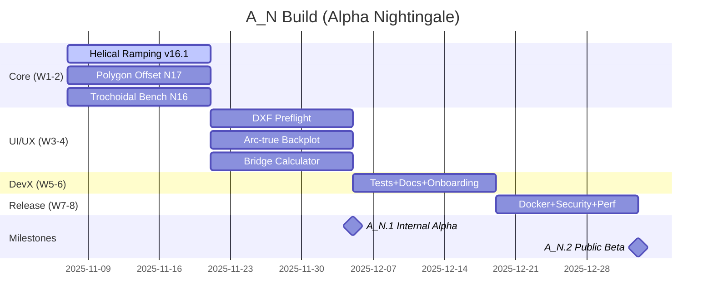

# A_N (Alpha Nightingale) Build Roadmap — Luthier’s Tool Box

**Target:** Q1 2026 • **Goal:** First public, production-ready CNC CAM for luthiers

---

## Phases & Milestones

- **Priority 1 (Weeks 1–2)** — Production CAM Core
  - v16.1 Helical Ramping (A_N.0.1)
  - N17 Polygon Offset integration
  - N16 Trochoidal Bench confirmations
  - CAM Essentials baseline

- **Priority 2 (Weeks 3–4)** — UI/UX Polish
  - DXF Preflight
  - Arc-true Backplot
  - Bridge Calculator

- **Priority 3 (Weeks 5–6)** — Dev Experience
  - 80% tests, Swagger/Postman
  - Onboarding Guide

- **Priority 4 (Weeks 7–8)** — Production Readiness
  - Docker + HTTPS, Security audit
  - Perf tuning (< 1s)

### Release Plan
- **A_N.1** (~Week 4): Internal alpha (10 luthiers)
- **A_N.2** (~Week 8): Public beta

---

## Mermaid Gantt (high-level)



---

## Branching Workflow (Feature-branch — Default)

- Branches per deliverable (e.g., `feature/helical-ramping-v16-1`, `feature/dxf-preflight`)
- Merge via **squash** into `main` with tags:
  - `A_N.0.1` (Helical Ramping), `A_N.1`, `A_N.2` etc.
- Pros: clean history, parallel work is easy, safer reviews
- Cons: more branches to manage

### Alternative: Single `A_N_main` branch
- One integration branch for the whole cycle; merges to `main` at A_N.1/A_N.2

---

## Bundle Contents
- `docs/CAM_Roadmap_AlphaNightingale.md`
- `project/alpha_n_board.json` (GitHub Projects skeleton)
- `.github/workflows/cam_smoke_matrix.yml` (nightly & manual CI smoke)
- `scripts/create-feature-branches.ps1` (scaffold branches)
- `scripts/switch-to-AN-main.ps1` (switch to single-branch flow)
- `scripts/smoke_matrix_local.ps1` (run local smoke suite)

## Quick Start
```powershell
# unzip into your repo root
git add docs/ .github/workflows/cam_smoke_matrix.yml project/ scripts/
git commit -m "docs(ci): A_N roadmap + smoke matrix"
git push

# create feature branches
powershell -ExecutionPolicy Bypass -File scripts\create-feature-branches.ps1

# (optional) switch to A_N_main model later
powershell -ExecutionPolicy Bypass -File scripts\switch-to-AN-main.ps1
```
