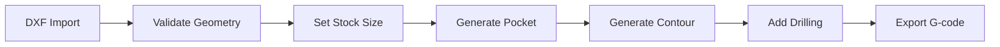

# Quick Start

Get productive with Luthier's ToolBox in 5 minutes.

---

## 1. Calculate String Tension

The Scale Length Designer helps you find the right string gauges for your instrument.

1. Navigate to **Tools > Scale Length Designer**
2. Select a preset (Fender 25.5", Gibson 24.75", etc.)
3. Adjust string gauges
4. View tension calculations

!!! tip "Mersenne's Law"
    Tension = (μ × (2 × L × f)²) ÷ 4

    Where μ is string mass density, L is scale length, and f is frequency.

---

## 2. Convert Units

The Unit Converter handles all common luthier measurements.

1. Navigate to **Tools > Scientific Calculator**
2. Select the **Converter** tab
3. Choose category: Length, Mass, Temperature, etc.
4. Enter value and select units

**Common conversions:**

| From | To | Example |
|------|----|---------|
| mm | inches | 25.4 mm = 1" |
| inches | mm | 1" = 25.4 mm |
| board feet | cm³ | 1 bf = 2,359.7 cm³ |

---

## 3. Import a DXF File

Process CAD files for CNC machining.

1. Navigate to **CAM > DXF Import**
2. Click **Upload** or drag a .dxf file
3. Review geometry validation
4. Fix any issues (open contours, self-intersections)
5. Proceed to toolpath generation

!!! warning "Supported DXF Versions"
    Best results with DXF R12-R2018. Some R2024 features may not be supported.

---

## 4. Generate a Toolpath

Create G-code for your CNC machine.

1. From DXF Import, click **Generate Toolpath**
2. Select operation type:
    - **Pocket** - Clear material from enclosed areas
    - **Contour** - Follow outlines
    - **Drill** - Point-to-point holes
3. Configure tool and feeds:
    - Tool diameter
    - Stepover %
    - Stepdown
    - Feed rate
4. Preview the toolpath
5. Export G-code

---

## 5. Design a Rosette

Create decorative sound hole patterns.

1. Navigate to **Art Studio > Rosette Designer**
2. Choose a base pattern (rings, segments, tiles)
3. Adjust parameters:
    - Inner/outer diameter
    - Number of segments
    - Rotation offset
4. Export as DXF or generate toolpath

---

## Example Workflow: Guitar Body

---

## Next Steps

- [Scale Length Designer](../features/scale-length.md) - Deep dive into tension calculations
- [Toolpath Generation](../features/toolpaths.md) - Advanced CAM operations
- [Machine Profiles](../cam/machine-profiles.md) - Configure your CNC
