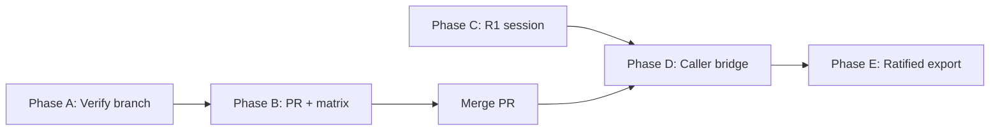

# Dev Order 80: IBG Provenance R2 Rollout — Annotated Developer Handoff

**Sprint:** DXF Lifecycle — IBG R namespace (completion)  
**Order:** DO 80  
**Status:** DEV-READY  
**Date:** 2026-05-26 (reconciled with DO 78)  
**Prerequisite:** `main` @ PR #44 (`225b1fd7`); branch `feat/ibg-provenance-r2-export-wrapper` @ `918f84d9` (R2 code on branch, **not on `main`** until merged)  
**Sequencing authority:** This document resolves R1-vs-R2 merge order; DO 78 § Sequencing must match.  
**Parent:** [DO_78_IBG_PROVENANCE_R_NAMESPACE_HANDOFF.md](DO_78_IBG_PROVENANCE_R_NAMESPACE_HANDOFF.md)  
**Plan:** [DXF_LIFECYCLE_SPRINT_DEVELOPER_PLAN.md](../plans/DXF_LIFECYCLE_SPRINT_DEVELOPER_PLAN.md)

---

## How to read this document

| Marker | Meaning |
|--------|---------|
| **DECISION** | Locked — do not relitigate in PR review |
| **ANNOTATION** | Reviewer / implementer context — why, not just what |
| **PATCH** | Exact file change expected |
| **VERIFY** | Command or test that proves done |

Sections are ordered for **rollout sequence** (bottom of doc). Skipping steps breaks CI or falsely promotes matrix rows.

---

## Executive summary

### Operational consequence — read before merging R2

**Merging R2 disables IBG DXF export in production by design.** After merge, `InstrumentBodyGenerator.save_dxf()` and `body_solver_router` DXF generation raise `IbgDxfExportBlockedError` until R1 ratification and the Phase D caller bridge supply a `RATIFIED` attachment. This is intentional fail-closed behavior for unratified reconstructed geometry—not a bug to patch out.

Integration tests keep working only where fixtures **patch** `governed_ibg_writer_saveas` (see `test_body_solver_integration.py`).

---

Phase **3A–3B** (non-IBG DXF lifecycle) is **complete on `main`**. Phase **R2** (IBG save wrapper) is **implemented on a feature branch** but **not merged** and **not matrix-complete**.

| Layer | State on `main` @ PR #44 | State on branch `918f84d9` |
|-------|--------------------------|----------------------------|
| Five save sites | Bare `writer.saveas` | `governed_ibg_writer_saveas` (verify Phase A) |
| `ibg_dxf_export_lifecycle.py` | Absent | Present |
| `is_exportable()` | `Literal[False]` always | `True` iff `status == RATIFIED` |
| Governance R1 | Not done | Not done |
| Matrix §3 | `BLOCKED_PROVENANCE` | Unchanged until Phase B PR |

**DO 80** finishes R2 rollout (PR + docs + matrix), runs the **R1 gate** in parallel, then wires **real provenance** (Phase D–E)—without skipping to `LIFECYCLE_GOVERNED`.

> **ANNOTATION:** DO 78 = constitutional spec. DO 80 = execution checklist. **Trust R2 `[existing]` claims only after Phase A VERIFY on the branch** — a `main`-only snapshot cannot see `918f84d9`.

---

## Locked decisions (DO 80)

### DECISION 1 — No direct jump to `LIFECYCLE_GOVERNED`

```text
BLOCKED_PROVENANCE → LIFECYCLE_GOVERNED   FORBIDDEN
```

Allowed: `BLOCKED_PROVENANCE` → (R1 + R2 + caller wiring) → `COMPAT_ONLY` with `provenance_status=YES` only when attachment `status == RATIFIED`.

Source: `docs/governance/IBG_DXF_LIFECYCLE_MAPPING_ADDENDUM.md` Rule 1.

### DECISION 2 — Wrapper is validation-only

`governed_ibg_writer_saveas` must **not** change DXF entities, layers, or R12 policy. It only: provenance check → lifecycle assert → `writer.saveas`.

### DECISION 3 — Fail-closed is intentional post-merge

Until R1 ratification, `create_ibg_provenance_draft()` → `status=BLOCKED` → `is_exportable() == False` → `IbgDxfExportBlockedError`.

> **ANNOTATION:** Do not “fix” failing `gen.save_dxf()` in production by removing the wrapper. Fix by R1 + ratified attachment factory or explicit API error mapping (422 + message).

### DECISION 4 — Test-only bypass is patch-only

Integration tests may `patch("app.util.ibg_dxf_export_lifecycle.governed_ibg_writer_saveas", ...)` in fixtures. **No** env-var production bypass.

### DECISION 5 — Matrix row transition requires governance PR

Reclassify the five IBG rows in the **same PR as R2 merge** (or immediate follow-up PR referencing R1 decision ID once signed).

### DECISION 6 — `provenance_status` vocabulary

Use guard values from `dxf_lifecycle_guard.py`: `NO`, `YES`, `BLOCKED`, `N/A` — **not** `NOT_ATTACHED` / `ATTACHED` (plan doc drift).

### DECISION 7 — R2 merge may precede R1 (aligned with DO 78)

| Milestone | Requires signed R1? |
|-----------|---------------------|
| Merge R2 PR to `main` | **No** — wrapper fail-closed; operationally inert for export |
| Production `save_dxf` / API DXF bytes | **Yes** |
| Phase D–E caller + ratified attachment | **Yes** |
| Matrix lifecycle “export enabled” | **Yes** |

> **ANNOTATION:** DO 78 previously said “do not branch R2 until R1” — **superseded** by this decision. R1 gates **legitimacy**, not **landing guard code**.

---

## Repo verification scope

| Snapshot | What you can verify |
|----------|---------------------|
| `main` @ PR #44 | Five bare `saveas`; matrix `BLOCKED`; `provenance_attachment.py` exists; **no** `governed_ibg_writer_saveas` |
| Branch `918f84d9` | R2 wrapper + wiring — **required** for Phase A |

```bash
git fetch origin
git checkout feat/ibg-provenance-r2-export-wrapper
cd services/api
rg "governed_ibg_writer_saveas|writer\.saveas" app/instrument_geometry/body/ibg
pytest tests/test_dxf_lifecycle_ibg_provenance_guards.py -q
```

---

## Current code inventory (branch `918f84d9` — run VERIFY before trusting)

### Utilities (implemented)

| Module | Symbol | Role |
|--------|--------|------|
| `app/util/ibg_dxf_export_lifecycle.py` | `IbgDxfExportBlockedError` | Fail-closed export denial |
| | `default_ibg_attachment_for_save()` | Blocked draft for save attempt |
| | `assert_ibg_dxf_export_allowed()` | Provenance + lifecycle context builder |
| | `governed_ibg_writer_saveas()` | Save boundary |
| `app/governance/provenance_attachment.py` | `create_ibg_provenance_draft()` | IBG draft factory |
| | `ProvenanceAttachmentDraft.is_exportable()` | On branch: `True` iff `RATIFIED`. On `main`: always `False` (`Literal[False]`) until R2 merges |
| `app/util/blueprint_dxf_export_lifecycle.py` | (reference) | Pattern for governed save; **do not merge** into IBG module |

### Save sites (implemented)

| File | Function | Site | Line (approx) |
|------|----------|------|----------------|
| `body_contour_solver.py` | `outline_to_dxf` | empty outline | ~791 |
| `body_contour_solver.py` | `outline_to_dxf` | full outline | ~827 |
| `arc_reconstructor.py` | `chains_to_dxf` | production write | ~1130 |
| `arc_reconstructor.py` | `create_visual_test_dxf` | test harness | ~1303 |
| `arc_reconstructor.py` | `create_simple_gap_test_dxf` | test harness | ~1337 |

> **ANNOTATION:** Line numbers drift—**VERIFY** with `rg "governed_ibg_writer_saveas|writer\.saveas" services/api/app/instrument_geometry/body/ibg` before editing.

### Tests (implemented)

| File | Coverage |
|------|----------|
| `tests/test_dxf_lifecycle_ibg_provenance_guards.py` | Source inspection, blocked draft, ratified guard path |
| `tests/test_body_solver_integration.py` | Fixture patches save boundary (API tests unrelated to provenance) |

### Not done (DO 80 scope)

| Item | Gap |
|------|-----|
| Matrix §3 five rows | Still `BLOCKED_PROVENANCE` / `ORCHESTRATOR` N/A |
| `DXF_LIFECYCLE_SPRINT_DEVELOPER_PLAN.md` | R namespace still “BLOCKED”, no R2 complete |
| R1 signed record | Missing under `docs/governance/` |
| `body_solver_router.py` | Calls `save_dxf` without ratified attachment |
| `instrument_body_generator.save_dxf` | Uses blocked draft only |
| `ibg_export_provenance.py` | `[new]` Phase D bridge stub |
| `body_solver_router` | `[new]` 422 on `IbgDxfExportBlockedError` |
| `ibg_workflow_pipeline` → export | Not yet wired to `save_dxf` |
| Ratification API | `ProvenanceRatificationNotAuthorizedError` — no runtime ratify |

---

## Scope

### In scope

1. Merge R2 branch (or rebase onto `main` and PR).
2. Update classification matrix + developer plan metrics.
3. Add R1 governance record template + fill after session.
4. Map `BodyEvidenceCandidate` → `ProvenanceAttachmentDraft` at export boundary.
5. API: structured error when export blocked (`IbgDxfExportBlockedError` → 422/503 per API convention).
6. Expand tests: router contract, workflow adapter unit test, matrix grep CI optional.
7. Document production posture in DO 78 status → R2 COMPLETE / R1 PENDING.

### Out of scope

| Item | Reason |
|------|--------|
| `LIFECYCLE_GOVERNED` for IBG | Separate dev order; needs orchestrator |
| Provenance bytes inside DXF file | Not ratified in R1 packet |
| MRP-6D / CAM-8A audit lanes | Not blocking |
| Vectorizer / blueprint_cam lifecycle | Complete (DO 77) |
| Runtime `ratify()` without governance session | `ProvenanceRatificationNotAuthorizedError` |

---

## File-by-file patch plan

Patches are ordered within each phase (see Rollout). **`[existing]`** = already on branch; **`[new]`** = DO 80 work.

### Phase A — Merge readiness (no new behavior)

| # | File | Action | PATCH detail |
|---|------|--------|----------------|
| A1 | `services/api/app/util/ibg_dxf_export_lifecycle.py` | `[existing]` Review | Confirm no `doc.saveas`; R12 constant matches DxfWriter |
| A2 | `body_contour_solver.py` | `[existing]` Review | `provenance_attachment` param on `outline_to_dxf`; both saves use wrapper |
| A3 | `arc_reconstructor.py` | `[existing]` Review | 3 wrappers; test helpers accept optional attachment |
| A4 | `instrument_body_generator.py` | `[existing]` Review | Passes `create_ibg_provenance_draft` — **will block** until Phase C |
| A5 | `provenance_attachment.py` | `[existing]` Review | `is_exportable()` only `RATIFIED` |
| A6 | `tests/test_dxf_lifecycle_ibg_provenance_guards.py` | `[existing]` | Must pass on CI Python version |
| A7 | `tests/test_body_solver_integration.py` | `[existing]` | Keep patch in `dreadnought_fixture_dxf` only |

**VERIFY**

```bash
cd services/api
pytest tests/test_dxf_lifecycle_ibg_provenance_guards.py -q
rg "writer\.saveas" app/instrument_geometry/body/ibg --glob "*.py"
# expect: no bare writer.saveas (only inside governed path / comments)
```

---

### Phase B — Documentation + matrix (same PR as merge)

| # | File | Action | PATCH detail |
|---|------|--------|----------------|
| B1 | `docs/governance/EXPORT_LIFECYCLE_CLASSIFICATION_MATRIX.md` | `[new]` | §3 five rows: `Guard Status` → `GUARD_ADDED`; add note “export gated by `governed_ibg_writer_saveas`”; keep `Lifecycle Status` `BLOCKED_PROVENANCE` until R1 signed **or** set `COMPAT_ONLY` with footnote “save requires RATIFIED attachment” per governance choice |
| B2 | `docs/plans/DXF_LIFECYCLE_SPRINT_DEVELOPER_PLAN.md` | `[new]` | R2 COMPLETE; metrics `BLOCKED_PROVENANCE` → 0 only after R1+export unlock **or** split metric `GUARD_ADDED: 25` (+5 IBG) |
| B3 | `docs/handoffs/DO_78_IBG_PROVENANCE_R_NAMESPACE_HANDOFF.md` | `[new]` | R2 → IMPLEMENTED; link PR number |
| B4 | `docs/governance/IBG_R1_RATIFICATION_RECORD_TEMPLATE.md` | `[new]` | See template section below |
| B5 | `docs/handoffs/DO_80_IBG_PROVENANCE_R2_ROLLOUT_ANNOTATED_HANDOFF.md` | `[existing]` | This document; check boxes on merge |

> **ANNOTATION (matrix):** Prefer **Guard `GUARD_ADDED` + Lifecycle `BLOCKED_PROVENANCE`** until R1 signs, then lifecycle → `COMPAT_ONLY` in a governance follow-up. Avoid claiming “export governed” while runtime still rejects all drafts.

**Matrix row patch (example — one row; repeat ×5):**

```markdown
| `instrument_geometry/body/ibg/body_contour_solver.py:808` | dxf-create-save | DxfWriter | Y | Y | GUARD | BLOCKED | runtime_service | BLOCKED | BLOCKED_PROVENANCE | blocked_provenance | GUARD_ADDED |
```

Change: `Lifecycle` column `N` → `GUARD`; `Guard Status` `BLOCKED_PROVENANCE` → `GUARD_ADDED`.

---

### Phase C — R1 governance gate (parallel track; blocks production export)

| # | File | Action | PATCH detail |
|---|------|--------|----------------|
| C1 | `docs/governance/IBG_R1_RATIFICATION_RECORD_YYYY-MM-DD.md` | `[new]` | Filled template after session |
| C2 | `docs/governance/CANONICAL_PROVENANCE_MODEL.md` | `[governance]` | Status → RATIFIED or superseded pointer |
| C3 | `docs/governance/IBG_CONSTITUTIONAL_RUNTIME_FOUNDATION.md` | `[governance]` | Pending → Ratified tier |

**R1 exit checklist (copy into record):**

- [ ] Decision ID: `IBG-R1-____`
- [ ] Required save-boundary fields frozen (from `IBG_PROVENANCE_ATTACHMENT_FIELD_MATRIX.md`)
- [ ] Epistemic posture approved (`predicted` / `heuristic` at export)
- [ ] Engineers authorized to implement Phase D attachment bridge

> **ANNOTATION:** Phase C can run in parallel with Phase A/B PR review. **Do not** mark matrix `COMPAT_ONLY` export-enabled until C is signed.

---

### Phase D — Caller provenance bridge (post-R1; production export)

| # | File | Action | PATCH detail |
|---|------|--------|----------------|
| D1 | `app/governance/ibg_export_provenance.py` | `[new]` | `attachment_from_body_evidence_candidate(candidate) -> ProvenanceAttachmentDraft`; map fields per field matrix |
| D2 | `app/governance/provenance_attachment.py` | `[new]` | Optional: `def build_ratified_ibg_attachment(...)` — **only** callable from governance-approved code path; raises if R1 record missing |
| D3 | `instrument_body_generator.py` | `[new]` | `save_dxf(..., candidate: Optional[BodyEvidenceCandidate] = None)`; build attachment from candidate or blocked draft |
| D4 | `body_solver_router.py` | `[new]` | Thread `session_id` / candidate into `save_dxf`; catch `IbgDxfExportBlockedError` → HTTP 422 with `blocking_reason` |
| D5 | `ibg_workflow_pipeline.py` | `[new]` | When exporting solved body, pass candidate with provenance chain into generator |
| D6 | `arc_reconstructor.py` | `[new]` | `chains_to_dxf(..., provenance_attachment=...)` required for production CLI paths; test DXFs may pass `_ratified_attachment_for_dev()` only in `__main__` behind `if __name__` with warning log |

**D1 sketch (implement after R1 field list):**

```python
def attachment_from_body_evidence_candidate(
    candidate: "BodyEvidenceCandidate",
    *,
    export_intent: str,
    ibg_run_id: str,
) -> ProvenanceAttachmentDraft:
    """Map constitutional candidate to save-boundary attachment (draft or ratified)."""
    # Map: source_artifact_id, derivation_chain, epistemic_status, topology score, etc.
    # status remains BLOCKED until governance ratification service marks RATIFIED
```

> **ANNOTATION:** Phase D is where “native work” connects MRP constitutional types to DXF save boundary. Without D, R2 is structurally correct but operationally blocked.

---

### Phase E — Ratified export enablement (post-R1 only)

| # | File | Action | PATCH detail |
|---|------|--------|----------------|
| E1 | `provenance_attachment.py` | `[new]` | Governance-only `mark_ratified_for_export(attachment_id, decision_id)` — updates status; sets fields per R1; **no** public API route without review |
| E2 | `ibg_dxf_export_lifecycle.py` | `[new]` | **Keep** `BLOCKED_PROVENANCE` context branch in `assert_ibg_dxf_export_allowed` — defense-in-depth; mark `# intentional: unreachable while fail-closed pre-check runs first` — **do not delete** as “dead code” |
| E3 | Matrix + plan | `[new]` | `BLOCKED_PROVENANCE` count → 0; IBG rows `COMPAT_ONLY` |

---

## Utility reference (for implementers)

### `governed_ibg_writer_saveas` call contract

```python
governed_ibg_writer_saveas(
    writer,
    output_path,
    attachment=attachment,          # Required for success: RATIFIED draft
    source_module=__name__,
    transformation_method="outline_to_dxf",  # Used only if attachment is None
)
```

| `attachment.status` | Result |
|---------------------|--------|
| `None` (no `transformation_method`) | `IbgDxfExportBlockedError` |
| `BLOCKED` / `DRAFT` / `PENDING_RATIFICATION` | `IbgDxfExportBlockedError` |
| `RATIFIED` | Guard `COMPAT_ONLY` + `provenance_status=YES` + save |

### Lifecycle context matrix (guard)

| Attachment state | `lifecycle_status` | `provenance_status` | Reaches `saveas`? |
|------------------|--------------------|---------------------|-------------------|
| Missing | — | — | No |
| Blocked draft | — | — | No (exception first) |
| Ratified | `COMPAT_ONLY` | `YES` | Yes |

> **ANNOTATION:** The `BLOCKED_PROVENANCE` branch after the exportable check is **unreachable today** but is a **safety backstop** if check order changes. Phase E **retains** it (see E2).

---

## Test plan (cases + ownership)

| ID | Test | File | Phase | Expected |
|----|------|------|-------|----------|
| T1 | No bare `writer.saveas` in IBG | `test_dxf_lifecycle_ibg_provenance_guards.py` | A | Pass |
| T2 | Blocked draft raises | same | A | `IbgDxfExportBlockedError` |
| T3 | Ratified attachment fires guard | same | A | 1× `COMPAT_ONLY` context |
| T4 | API fixture still generates DXF | `test_body_solver_integration.py` | A | Patch wrapper |
| T5 | `save_dxf` raises without ratified | `test_ibg_save_dxf_fail_closed.py` `[new]` | B | Raises blocked |
| T6 | `attachment_from_body_evidence_candidate` maps fields | `test_ibg_export_provenance.py` `[new]` | D | Field parity table |
| T7 | Router returns 422 on blocked export | `test_body_solver_router_export.py` `[new]` | D | JSON `blocking_reason` |
| T8 | Ratified path produces byte-identical DXF | `test_ibg_export_output_unchanged.py` `[new]` | E | Hash match pre/post wrapper |
| T9 | Matrix grep CI | `test_governance_compliance.py` optional | B | 5 rows `GUARD_ADDED` |

**Regression bundle (pre-merge):**

```bash
cd services/api
pytest tests/test_dxf_lifecycle_ibg_provenance_guards.py \
       tests/test_dxf_lifecycle_guard.py \
       tests/test_body_solver_integration.py -q
```

**Full lifecycle suite (optional):**

```bash
pytest tests/test_dxf_lifecycle*.py -q
```

---

## Rollout order (execution sequence)



| Step | Phase | Owner | Output | Blocker |
|------|-------|-------|--------|---------|
| 1 | A | Engineering | Green T1–T4 **on branch** | Checkout `918f84d9` |
| 2 | B | Engineering | PR to `main` | Step 1 |
| 3 | — | Engineering | **Merge R2** | Step 2 — **R1 not required**; export stays blocked |
| 4 | C | Governance | Signed `IBG_R1_RATIFICATION_RECORD_*.md` | Parallel with 2–3 |
| 5 | D | Engineering | Caller bridge PR | Step 4 signed |
| 6 | E | Governance + Eng | Export enabled | Step 5 + ratification service |

> **ANNOTATION:** Steps 2–4 can overlap Step 4 (R1) in calendar time. **Steps 5–6 must not** ship before R1 sign-off. **Step 3** intentionally breaks production IBG DXF until Step 6 — see executive summary.

---

## PR template (Phase A+B)

**Title:** `feat(ibg): complete provenance-aware DXF save wrapper rollout (DO 80)`

**Summary**

- Completes DO 79 R2: five IBG saves via `governed_ibg_writer_saveas`
- Fail-closed until `ProvenanceAttachmentStatus.RATIFIED`
- Updates lifecycle matrix guard column; adds DO 80 handoff
- Does not enable production export without R1 (Phase D/E follow-up)

**Test plan**

- [ ] T1–T4
- [ ] `rg` no bare `writer.saveas` in IBG

**Governance**

- [ ] Link R1 decision ID (or “R1 pending — export blocked by design”)

---

## R1 ratification record template (create as B4)

Save as `docs/governance/IBG_R1_RATIFICATION_RECORD_TEMPLATE.md`:

```markdown
# IBG Provenance R1 Ratification Record

**Decision ID:** IBG-R1-________  
**Date:** YYYY-MM-DD  
**Participants:**  
**Status:** SIGNED | DRAFT

## Ratified documents
- [ ] CANONICAL_PROVENANCE_MODEL.md (version: ___)
- [ ] IBG_CONSTITUTIONAL_RUNTIME_FOUNDATION.md (version: ___)

## Approved save-boundary fields
(mandatory list from IBG_PROVENANCE_ATTACHMENT_FIELD_MATRIX.md)

## Epistemic posture at export
- Default: predicted / heuristic
- Production OBSERVED/DERIVED: forbidden without separate ADR

## Engineering authorization
- [ ] Phase D caller bridge approved
- [ ] Phase E ratification mechanism approved

## Sign-off
- Governance owner: ___
```

---

## Acceptance criteria (DO 80 complete)

### Merge track (may ship before R1 — Decision 7)

- [ ] Phase A VERIFY run on branch `918f84d9` (not `main`-only review)
- [ ] PR merged; branch `feat/ibg-provenance-r2-export-wrapper` closed
- [ ] T1–T4 green on CI
- [ ] PR body states: production IBG DXF export disabled until R1 + Phase D
- [ ] Matrix: five rows `GUARD_ADDED`, lifecycle column documents guard (export still blocked)
- [ ] Developer plan: R2 noted complete; R1/R3+ explicit
- [ ] No bare `writer.saveas` in IBG production paths

### Production export track (after R1)

- [ ] R1 record signed with decision ID
- [ ] Phase D merged; T6–T7 green
- [ ] Phase E: ratified export path; T8 byte identity
- [ ] `BLOCKED_PROVENANCE` metric 0 in plan

---

## Risk register (annotated)

| Risk | Mitigation |
|------|------------|
| Merge breaks `POST /api/body/*` DXF responses | **Expected by design** — see executive summary; API changelog; 422 mapping in Phase D; fixture patch for tests |
| Reviewer assumes “GUARD_ADDED = export OK” | PR body + matrix footnote: export gated by RATIFIED |
| Field matrix drift vs `BodyEvidenceCandidate` | Phase D mapping table unit test T6 |
| Confusion with `blueprint_dxf_export_lifecycle` | DECISION: separate modules; different lifecycle_status |
| Python 3.14 local ezdxf skip | CI is source of truth for integration tests |

---

## Reference index

| Document | Use |
|----------|-----|
| `DO_78_IBG_PROVENANCE_R_NAMESPACE_HANDOFF.md` | Constitutional scope R1/R2 |
| `IBG_PROVENANCE_RATIFICATION_PACKET.md` | R1 session agenda |
| `IBG_PROVENANCE_ATTACHMENT_FIELD_MATRIX.md` | Phase D field mapping |
| `IBG_DXF_LIFECYCLE_MAPPING_ADDENDUM.md` | Transition rules |
| `RUNTIME_BOUNDARY_INVENTORY.md` | Phase 2 IBG attachment |
| `DO_77_DXF_LIFECYCLE_PHASE_3B.md` | Prior complete phase |

---

## Quick start (developer picking up today)

```bash
git fetch origin
git checkout feat/ibg-provenance-r2-export-wrapper
# or: git checkout main && git pull && git checkout -b feat/ibg-do80-rollout

cd services/api
pytest tests/test_dxf_lifecycle_ibg_provenance_guards.py -q
rg "governed_ibg_writer_saveas|writer\.saveas" app/instrument_geometry/body/ibg
```

1. Complete Phase A VERIFY.  
2. Open PR for Phase B.  
3. Schedule Phase C with governance owner.  
4. Do **not** start Phase E until R1 record exists.

---

*DO 80 — Annotated handoff for IBG R2 rollout completion and R1-gated production export. Questions: cite Decision ID and phase letter (A–E).*
